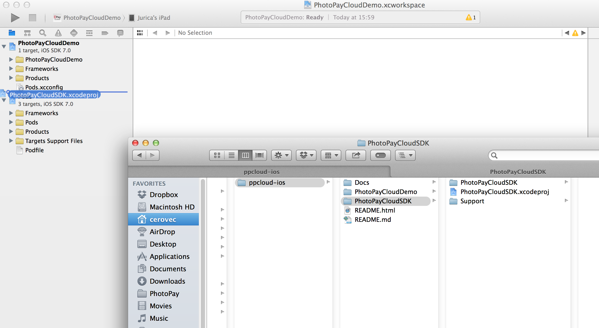
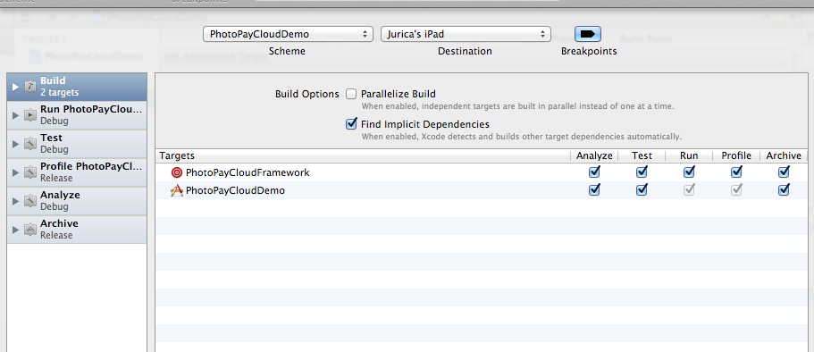
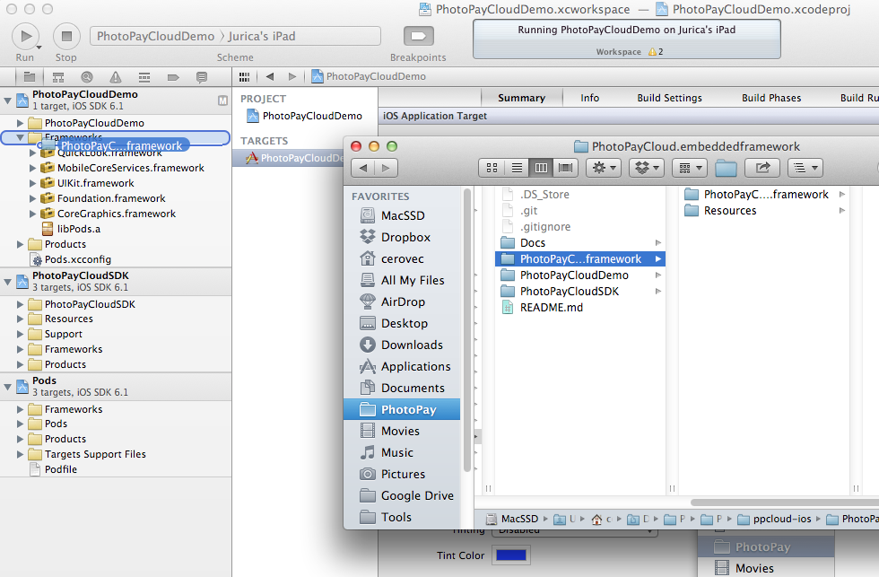
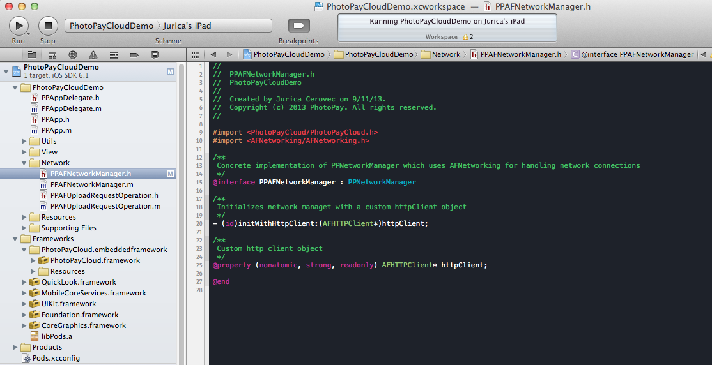
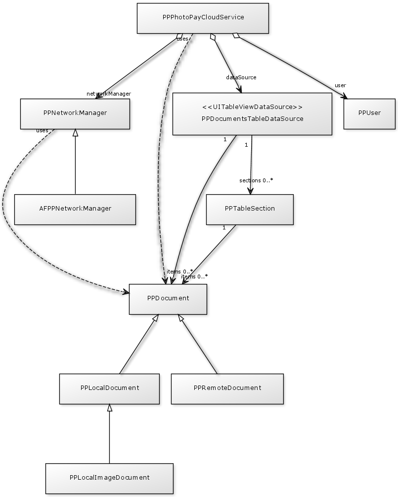

# PhotoPayCloud SDK for iOS

PhotoPayCloud is a system for easy and efficient payment data extraction from various payment documents. Documents can be PDF invoices, Excel sheets, Word documents, photos of paper bills and various other formats. PhotoPayCloud provides secure storage of these payment documents, as well as enables easy and simple payment method used for users of mobile banking applications.

This package contains client side SDK for accessing PhotoPayCloud web services on iOS.

Structure of the README document is as follows

- [Getting Started](#1) which explains a little more about the structure of this repository
- [Setting up your Xcode workspace](#2) which shows you how to connect the PhotoPayCloud SDK with your Xcode project
- [Common operations](#3) which explains the procedures you have to implement to get a working app

Common operations include the following procedures:

1. [Initializing the PhotoPayCloud Service for a specific user](#301)
2. [Checking for unfinished and pending uploads](#302)
3. [Creating a View Controller which display a list of documents](#303)
4. [Uploading new documents and images to processing server](#304)
5. [Displaying user help](#305)
6. [Retrieving scanning results](#306)
7. [Opening details view](#307)
8. [Requesting all documents with specific document state](#308)
9. [Deleting a document](#309)
10. [Confirming user’s data when paying a document](#310)
11. [Retrieving a document thumbnail and preview images](#311)
12. [Retrieving the whole document](#312)
13. [Uninitializing PPPhotoPayCloudService object](#313)

##  Getting started

Since this is a private git repository, the easiest way to stay up to date with the latest versions is to setup this repository as a git submodule inside your project's repository.

	cd <your-repo>
	git submodule add https://github.com/PhotoPay/ppcloud-ios.git ppcloud-ios
	
This will clone the whole ppcloud-ios repository and check out master branch. Any subsequent pulls inside your repository will automatically pull changes in ppcloud-ios repository as well.

Inside ppcloud-ios there are two separate projects. 

PhotoPayCloudSDK is a project which builds the PhotoPayCloud framework. This is the framework which communicates with PhotoPay Cloud web services and you should use it inside your application. 

There is also a PhotoPayCloudDemo application which shows an example on how to do a proper integration. PhotoPayCloudDemo app additionaly uses AFNetworking library for network communication. If you use it in your application, the integration is even more simplified because you can simply copy AFNetworking wrappers for PhotoPayCloud into your application from PhotoPayCloudDemo app.

To run PhotoPayCloudDemo you need CocoaPods installed. To set up CocoaPods dependencies you should run:

	cd <PhotoPayCloudDemo-folder>
	pod install

##  Setting up your Xcode workspace

The easiest way to use PhotoPayCloudSDK with your Xcode project is to add it into your Xcode workspace. Simply drag and drop PhotoPayCloudSDK.xcodeproj file to your workspace, below your project, on the same hierarchy level. 

After that, edit the sceme for building your application. Add __PhotoPayCloudFramework__ build target into your scheme, and set it to be built before your application's target. Also, disable "Parallelize Build" option. This will ensure PhotoPayCloudSDK is always rebuilt with the lastest updates before running your application. 

Now, start your application's build scheme. It will result with PhotoPayCloud.embeddedframework being created inside ppcloud-ios repository. Drag and drop it in the Frameworks group in your project. When asked, disable option "Copy items into destination group's folder"

Now you have everything set up to start the coding part. But first we can cover some of the basic PhotoPayCloudSDK architecture.

##  Common operations

###  1. Initializing the PhotoPayCloud Service for a specific user

The initialization method like the following should be called whenever a user logs in to the application. The method should specify data about the current user, as well as an object reposnsible for making network requests (PPNetworkManager object). For example, if you use AFNetworking, you can use PPAFNetworkManager class provided in the PhotoPayCloudDemo application, but you have to provide your own AFHTTPRequestOperationManager object.

	- (void)photoPayCloudLogin {
    	PPAFNetworkManager* networkManager = [[PPAFNetworkManager alloc] initWithRequestOperationManager:[PPAppDelegate requestOperationManager]];
		[networkManager setMaxConcurrentUploadsCount:1];
		
		PPUser* user = [[PPUser alloc] initWithUserId:[[PPApp sharedApp] userId]
                                   	   organizationId:@"Your_organisation_name"]; // e.g. @"EBS"
    
    	[[PPPhotoPayCloudService sharedService] initializeForUser:user 
    										   withNetworkManager:networkManager];
	}
	
All following tasks depend on successfully initialized PPPhotoPayCloudService object

#### PPNetworkManager

PPNetworkManager is an abstract class for creating web requests for communicating with PhotoPayCloud Web API. It defines the interface which a concrete implementation must provide so that it can be used with PPPhotoPayCloudService object.

For example, PhotoPayCloudDemo application defines a concrete implementation of PPNetworkManager interface which uses AFNetworking library for managing network communication. If you use AFNetworking inside your application, consider using those classes. 

If you don't use AFNetworking, consider switching to it (it's an impressive library), or contact us so we can come up with some other option.

#### PPUser

An object which specifies the user of the PhotoPayCloud service. User is defined with the following properties:

- userId
- organizationId
- userType

userId must be unique for each user of your app. Organisation ID is the unique string ID of the organization which uses your app. User type can be _Person_, _Business_ or _Craft_, but _Person_ is typically used if not specified otherwise.

It's important to note that userId is never stored locally on the mobile device. The only user's data which is stored on the user's phone is MD5 hash of the userId, and it's only used for identifying documents which need to be uploaded until upload finishes, or until user deletes the document.

###  2. Checking for unfinished and pending uploads

After the user logs in into the application, you should check if any pending uploads exist which didn't successfully complete. If they exist, the user should have the opportunity to continue those uploads, or delete them permanently.

	- (void)checkPhotoPayCloudUploads {
    	// check if PhotoPayCloudService was paused
    	if ([[PPPhotoPayCloudService sharedService] state] == PPPhotoPayCloudServiceStatePaused) {
        	
        	// if true, ask user to continue or abort paused requests
        	PPAlertView* alertView = [[PPAlertView alloc] initWithTitle:@"Some documents failed to upload")
                                                            	message:@"Would you like to continue uploading these documents?"
                                                         	 completion:^(BOOL cancelled, NSInteger buttonIndex) {
                                                             	NSError* __autoreleasing error = nil;
                                                             	if (buttonIndex == 0) {
                                                                 	[[PPPhotoPayCloudService sharedService] deletePendingDocumentsWithError:&error];
                                                             	} else if (buttonIndex == 1) {
                                                                 	[[PPPhotoPayCloudService sharedService] uploadPendingDocuments];
                                                             	}
                                                         	 }
                                                  	 cancelButtonTitle:@"Abort"
                                                  	 otherButtonTitles:@"Continue", nil];
        	[alertView show];
    	}
	}

###  3. Creating a View Controller which display a list of documents

PhotoPay Cloud Home View is a view which contains a list of all user's documents. This View also has a button which can start camera capture for taking a photo of a user's bill. 

List of all user's documents is a UITableView, with each table view cell corresponding to one document. Cell can be pressed to open a Details view for a corresponding document.

You can design the Home view as you wish, but the easiest way to set up the basic functionality is to use your own subclass of PPDocumentsTableDataSource class for maintaining a list of PPDocument objects inside your Table view.

#### PPDocumentsTableDataSource subclass

To use PPDocumentsTableDataSource as a data source for your UITableViews, you must subclass it and provide methods for creaing UITableViewCells:

	// .... header

	@interface PPDocumentsDataSource : PPDocumentsTableDataSource
	
	@end
	
	// .... implementation

	- (UITableViewCell *)tableView:(UITableView *)tableView
         	 cellForRowAtIndexPath:(NSIndexPath *)indexPath {
    
    	// Obtain document object for given index path
    	PPDocument *document = [self itemForIndexPath:indexPath];
    
    	PPDocumentTableViewCell *cell = // your UI specific code which uses data from document object
    
    	return cell;
	}
	
	
One example on how to do that is given in PhotoPayCloudDemo project and is a fairly standard way of achieving this. 

An instance method of PPDocumentsTableDataSource class which will definitely help for populating UITableViewCells with data about PPDocument objects is

	// Obtain document object for given index path
    PPDocument *document = [self itemForIndexPath:indexPath];

#### PPDocumentsTableViewController

Second part of implementing a Home view controller is creating a PPBaseDocumentsTableViewController subclass, commonly called PPDocumentsTableViewController. This is a UITableViewController object responsible for maintaing and controlling UITableView with documents, receiving events on upload progress, and receiving events on document fetch requests.

To implement the subclass, the following code is all that is needed. It sets the data source object, and initializes the SectionCreator object which separates uploading documents into Table Section on top of the list, and processed documents into Table Section the bottom of the list.

	// .... header

	@interface PPDocumentsTableViewController : PPBaseDocumentsTableViewController

	@end
	
	// .... implementation 

	@implementation PPDocumentsTableViewController

	- (void)viewDidLoad {
    	[super viewDidLoad];
    
    	self.dataSource = [[PPDocumentsDataSource alloc] init];
    
    	// Specify section creator object which splits the uploading documents into two sections
    	// One for uploading documents, one for those which are processing or done
    
    	PPSplitTypeDocumentsSectionCreator* sectionCreator = [[PPSplitTypeDocumentsSectionCreator alloc] init];
    	[sectionCreator setUploadingSectionTitle:_(@"PhotoPayHomeUploadingSectionTitle")];
    	[sectionCreator setProcessedSectionTitle:_(@"PhotoPayHomeProcessedSectionTitle")];
    	self.dataSource.sectionCreator = sectionCreator;
    
    	[[PPPhotoPayCloudService sharedService] setDataSource:(PPDocumentsDataSource*)[self dataSource]];
	}
	
	@end
	
If your UITableViewCells support upload progress monitoring with UIProgressView, you can implement a callback method of PPBaseDocumentsTableViewController which will update the UIProgressView.

	#pragma mark - PPDocumentUploadDelegate
	
	- (void)localDocument:(PPLocalDocument *)localDocument
	didUpdateProgressWithBytesWritten:(long long)totalBytesWritten
    	            totalBytesToWrite:(long long)totalBytesToWrite {
    
    	// instead of requesting the whole table to update, we just find the potential cell among visible cells
    	for (PPDocumentTableViewCell* cell in self.tableView.visibleCells) {
        	if (cell.document.state == PPDocumentStateUploading) {
            	[cell refreshProgress];
        	}
    	}
	}
	
You can also perform additional changes to modify the design of this UITableViewController. For example, you can add UIRefreshControl, modify the height of the cells, etc.

### HomeViewController

HomeViewController is a ViewController responsible for holding a PPDocumentsTableViewController with a list of documents, and for extending the possibilities for user interaction by offering a UIButton for taking pictures and a button for opening usage instructions. Typically, it's implemented as a PPBaseHomeViewController subclass.

It's enough to provide a UIButton or UIBarButtonItem for opening a camera, UIButton or UIBarButtonItem for opening help, and to set PPDocumentsTableViewController as underlying tableViewController. 

Besides that, implementation provided here overrides uploadImage: method, responsible for creating PPLocalDocument for upload, and openDocumentDetailsView: method, responsible for opening a details view controller on tap event on UITableViewCell.

	// .... header

	/** When opening PhotoPay, user sees view controlled by this view controller */
	@interface PPHomeViewController : PPBaseHomeViewController

	/** Button which starts the photo capture */
	@property (weak, nonatomic) IBOutlet UIButton *cameraButton;

	/** Callback on camera button pressed */
	- (IBAction)cameraButtonPressed:(id)sender;

	@end
	
	// .... implementation 

	@implementation PPHomeViewController

	- (void)viewDidLoad {
    	[super viewDidLoad];
    
    	[self setTitle:_(@"PhotoPayHomeTitle")];
    
    	// Add table view controller
    	self.tableViewController = [[PPDocumentsTableViewController alloc] initWithNibName:@"PPDocumentsTableViewController" bundle:nil];
    	[self.tableViewController setDocumentStates:PPDocumentStateLocal | PPDocumentStateRemoteUnconfirmed];
    	[self.tableViewController setDelegate:self];
    	[self.tableViewController setPollInterval:@(10.0f)];
    
    	// Add help button
    	UIBarButtonItem *helpBarItem = [[UIBarButtonItem alloc] initWithTitle:_(@"PhotoPayHelpButtonTitle")
                                                                    	style:UIBarButtonItemStyleBordered
                                                                   	   target:self
                                                                   	   action:@selector(openHelp)];
    	self.navigationItem.rightBarButtonItem = helpBarItem;
	}
	
	- (void)uploadImage:(UIImage*)image {
    
    	// create a local document for this user
    	PPLocalDocument *document = [[PPLocalImageDocument alloc] initWithImage:image
                                                             	 processingType:[[PPProfile sharedProfile] photoProcessingType]];
    
    	[self uploadDocument:document];
	}

	- (void)openDocumentDetailsView:(PPDocument*)document {
    	PPDocumentDetailsViewController* documentDetails =
    	[[PPDocumentDetailsViewController alloc] initWithNibName:[PPDocumentDetailsViewController defaultXibName]
                                                      	  bundle:nil
                                                    	document:document];
    
    	[[self navigationController] pushViewController:documentDetails animated:YES];
	}

###  4. Uploading new documents and images to processing server

You can use provided uploadImage: method in the PPBaseHomeViewController, but your requirements might be different. For example, you might want to specify some other PPDocumentProcessingType, instead of the default PPDocumentProcessingTypeSerbianPhotoInvoice.

Look at the implementation of PPBaseHomeViewController in our open SDK project to see the details of document uploading methods. However, in most cases default implementation should be enough.
	
###  5. Displaying user help

PPBaseHomeViewController is able to display the default instructions page. Method openHelp is responsible for this. It instantiates PPPagedContentViewController object and displays it modally.

You can override openHelp in your HomeViewController implementation, but in most cases default should be enough.

###  6. Retrieving scanning results

Scanning results are easily obtained from PPRemoteDocument object by accessing it's scanResult property. Scanning results are provided as a PPScanResult object. 

	PPScanResult *scanResult = [[document remoteDocument] scanResult];
	
PPScanResult has multiple subclasses. Which PPScanResult subtype is actually used for scanResult, depends on the processing type used when uploading the document. Here is the table of processing type values with PPScanResult subclasses:

|           Processing Type    				   |    PPScanResult     |
|:--------------------------------------------:|:-------------------:|
| PPDocumentProcessingTypeAustrianPDFInvoice   | PPScanResultAustria |
| PPDocumentProcessingTypeAustrianPhotoInvoice | PPScanResultAustria |
| PPDocumentProcessingTypeSerbianPDFInvoice    | PPScanResultSerbia  |
| PPDocumentProcessingTypeSerbianPhotoInvoice  | PPScanResultSerbia  |

After you cast the scanResult object to specific PPScanResult subtype, you have new methods available for accessing specific values form the documents. For example, you might want to obtain AccountNumber candidate from PPScanResultSerbia object:

	PPScanResultSerbia* serbianResult = (PPScanResultSerbia*)[remoteDocument scanResult];
	PPElementCandidate* accountCandidate = [[serbianResult mostProbableAccountNumberCandidate] value];
	
Each PPElementCandidate object has a confidence level (given as a integer number from 0 to 2000), and a concrete NSString* value.

Besides obtaining the most probable PPElementCandidate object, you can also obtain all candidates for a specific item from given scan result:

	PPElementCandidateList* accountCandiadteList = [serbianResult accountNumberCandidateList];
	
PPElementCandidateList object contains an NSArray of candidates sorted by decreasing confidence level (meaning, the candidate with the highest confidence level is at the front of the array).
	
###  7. Opening details view

When user taps a specific cell in a HomeViewController list, you should open a view which gives more details about the underlying document. That means you are responsible for developing a ViewController for this. Details View is opened on openDocumentDetailsView: event in your HomeViewController.

You can register your Details View Controller to be the delegate for upload progress reporting:

	[[[document localDocument] uploadRequest] setDelegate:self];
	
Also, the Details View Controller can be a delegate for document state change, so that you can replace details views on the fly after a document changes it's state:

	[document setDelegate:self];

You can design the view controller as you think it's best, but we recommend that PPDocument object in different states has different design of Details View. 

| PPDocumentState                      | Design of DetailsViewController |
|:------------------------------------:|:-------------------------------:|
| PPDocumentStateLocalUploadInProgress | Present a status that document is being uploaded together with a UIProgressBar with upload progress
| PPDocumentStateUploadFailed		   | Present a status that document upload failed, with a button to retry the upload				
| PPDocumentStateUnprocessed	       | Present a status that document is received by the server and processing is in progress
| PPDocumentStateProcessed			   | Present a status that document is processed, together with real scanning results (see 6. Retrieving scanning results). Also, a button for payment should be added, if all scanned data is valid.
| PPDocumentStateProcessedWithError	   | Present a status that the error has occurred while the document was being processed
| PPDocumentStatePaid				   | Preset a information that the document was paid

For all states, provide a button for deleting a document.

###  8. Requesting all documents with specific document state

In HomeViewController, when you want to display documents, you are required to specify which document states you're interested in. When you know the states, you can make a request for documents in the following way:

	// first, set the document states you're interested in
	self.tableViewController.documentStates = PDocumentStateLocal | PPDocumentStateRemoteUnconfirmed;
	
	// then, make a request for documents
	[[self tableViewController] requestDocuments];
	
If your tableViewController (see section about PPDocumentsTableViewController objects), has pollInterval property set to a NSNumber value other than nil, documents with specified states will be requested periodically, each pollInterval seconds. If pollInterval is nil, only one document request will be made.

###  9. Deleting a document

To delete a document, use the following code:

	[[PPPhotoPayCloudService sharedService] deleteDocument:document error:&error];

###  10. Confirming user's data when paying a document

When the user actually makes the payment, it's required that PhotoPayCloud Service is notified for the correct data used for the actual payment. To notify the Service about confirmed data perform the following steps:

Initialize the proper PPUserConfirmedValues object. Depending on the processing type used by the document, initialize one of the following PPUserConfirmedValues subclasses

|          Processing Type    				   |    PPUserConfirmedValues     |
|:--------------------------------------------:|:----------------------------:|
| PPDocumentProcessingTypeAustrianPDFInvoice   | PPUserConfirmedValuesAustria |
| PPDocumentProcessingTypeAustrianPhotoInvoice | PPUserConfirmedValuesAustria |
| PPDocumentProcessingTypeSerbianPDFInvoice    | PPUserConfirmedValuesSerbia  |
| PPDocumentProcessingTypeSerbianPhotoInvoice  | PPUserConfirmedValuesSerbia  |

###  11. Retrieving a document thumbnail and preview images

Any document object, no matter if it's PPLocalDocument or PPRemoteDocument, has an instance method for obtaining thumbnails and preview images. Simply use:

	[document thumbnailImageWithSuccess:^(UIImage *thumbnailImage) {
        // your code
    } failure:^{
        // your code
    }];
    
for accessing thumbails, or 

	[document previewImageWithSuccess:^(UIImage *previewImage) {
   		// your code
	} failure:^(){
		// your code
	}];
	
for accessing preview images.

###  12. Retrieving the whole document

For retrieving the whole document, for example, PDF invoice, use the following instance method on PPDocument object

    [document documentBytesWithSuccess:^(NSData *bytes) {
        // your code
    } failure:{
    	// your code
    }];

See PPDocumentPreview and PPQLPreviewController classes in the Demo app for a quick demo on how to implement a working document preview View Controller.
 
###  13. Uninitializing PPPhotoPayCloudService object

Inverse method to initialization should be performed every time the user logs out from the application. 

	- (void)photoPayCloudLogout {
    	[[PPPhotoPayCloudService sharedService] uninitialize];
	}

<!--(

## Overview of PhotoPayCloudSDK architecture

Your integration procedure can also be achieved on much lower level, by interacting directly with PPPhotoPayCloudService object. Using PhotoPayCloudSDK primarily means collaborating with the following classes:

### PPPhotoPayCloudService

PPPhotoPayCloudService is a singleton object responsible for performing all high level requests. It can be accessed using:

	[PPPhotoPayCloudService sharedService] 
	
PPPhotoPayCloudService object can perform the following tasks:

Uploading documents to PhotoPay Cloud web API:

	- (void)uploadDocument:(PPLocalDocument*)document
              	  delegate:(id<PPDocumentUploadDelegate>)delegate
                   success:(void (^)(PPLocalDocument* localDocument, PPRemoteDocument* remoteDocument))success
                   failure:(void (^)(PPLocalDocument* localDocument, NSError* error))failure
                  canceled:(void (^)(PPLocalDocument* localDocument))canceled;

Uploading all pending documents which failed to upload in the last usage session

	- (void)uploadPendingDocuments;

Deleting all pending documents

	- (void)deletePendingDocumentsWithError:(NSError**)error;

Retrieving the image for the document. Image size can be specified, for example thumnail size.

	- (void)getImageForDocument:(PPRemoteDocument*)document
                  	  imageSize:(PPImageSize)imageSize
                	imageFormat:(PPImageFormat)imageFormat
                    	success:(void (^)(UIImage* image))success
                    	failure:(void (^)(NSError* error))failure
                   	   canceled:(void (^)())canceled;

Retrieving the actual document. The whole byte array containing the document is retrieved.

	- (void)getDocumentData:(PPRemoteDocument*)document
                	success:(void (^)(NSData* data))success
                	failure:(void (^)(NSError* error))failure
               	   canceled:(void (^)())canceled;

Associating the values user used for making the payment with a document

	- (void)confirmValues:(PPUserConfirmedValues*)values
           	  forDocument:(PPRemoteDocument*)document
               	  success:(void (^)(void))success
               	  failure:(void (^)(NSError* error))failure
              	 canceled:(void (^)(void))canceled;

Deleting the document

	- (void)deleteDocument:(PPDocument*)document
                 	 error:(NSError**)error;

Requesting documents with a given status which should populate PPDocumentsTableDataSource object. Only a single request is made.

	- (void)requestDocuments:(PPDocumentState)documentStateList;

Requesting documents which should populate PPDocumentsTableDataSource object. After that call, polling is used each _timeInterval_ seconds. 

	- (void)requestDocuments:(PPDocumentState)documentStateList
            	pollInterval:(NSTimeInterval)timeInterval;

These features are everything that's required to provide a well designed user experience.

### PPDocument (and subclasses)

PPDocument is an ecapsulation of a document used in the payment process. A PPDocument object can be either PPLocalDocument (for example, an image obtained from the camera which still wasn't uploaded to PhotoPayCloud web service), or PPRemoteDocument (for example, the same image, but uploaded to server, processed and ready for payment). Furthermore, PPLocalDocument can be PPLocalImageDocument, when created from an UIImage object.

The most important properties of a PPDocument objects are documentType (png, jpeg, pdf, etc.), processing type, which defines what kind of processing will PhotoPayCloud server perform on this document, and a PPDocumentState. State defines what's happening with the document at the moment.

Each document starts as a PPLocalDocument in state Created, goes through a variety of states, for example, Uploading, Received, Processing, Processed, etc. For a document, the goal is to finish as a PPRemoteDocument in state Processed. When in this state, the document can be used to prepopulate a payment form with scanned payment data.

For example, for serbian invoices, documents are typically created as a PPLocalImageDocument subtype, with initializer:

	- (id)initWithImage:(UIImage*)inImage processingType:(PPDocumentProcessingType)inProcessingType 
	
PPDocumentProcessingType for photos of Serbian invoices is _PPDocumentProcessingTypeSerbianPhotoInvoice_

#### Operations on all PPDocument objects

Observing document state can be done by examining state property 

	@property (nonatomic, assign) PPDocumentState state;
	
Also, if needed, there is a PPDocumentStateChangedDelegate protocol available which can notify your object for any state changed events.

Each PPDocument has methods for accessing thumbnail image, preview image and the original document's byte array:

	- (void)thumbnailImageWithSuccess:(void (^)(UIImage* thumbnailImage))success
                          	 failure:(void (^)(void))failure;

	- (void)previewImageWithSuccess:(void (^)(UIImage* previewImage))success
                        	failure:(void (^)(void))failure;

	- (void)documentBytesWithSuccess:(void (^)(NSData* bytes))success
	                         failure:(void (^)(void))failure;
	                         
Also, there is a way to safely cast a PPDocument to any of it's subclasses. These methods return nil if cast is not successful.

	- (PPLocalDocument*)localDocument;
	- (PPRemoteDocument*)remoteDocument;

#### Operations on PPLocalDocument objects

Local document object have access to PPUploadRequestOperation for monitoring uploads

#### Operations on PPRemoteDocument objects

Interesting properties of PPRemoteDocument objects are

	@property (nonatomic, strong) NSNumber* expectedProcessingTime;
	@property (nonatomic, strong) PPScanResult* scanResult;
	
### PPDocumentsTableDataSource

PPPhotoPayCloudService object maintains it's own object which can be used as a UITableViewDataSource. The concrete implementation of this object can be overridden in your app, but the idea is that PPPhotoPayCloudService singleton object is responsible for maintaining a list of all documents of interest to the current user.

Division of documents in section inside PPDocumentsTableDataSource can be specified separately, but more on that later.

### Rough class diagram of most important classes

)-->