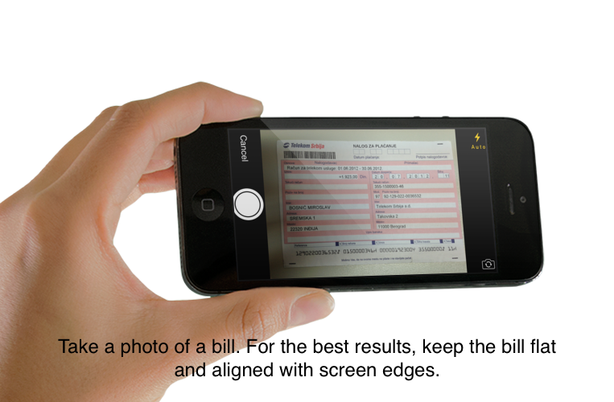
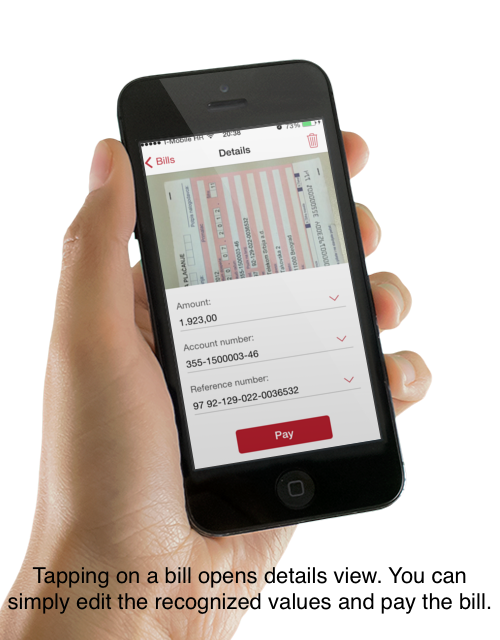
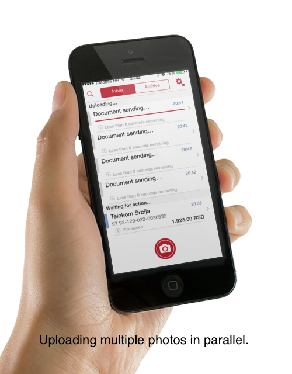
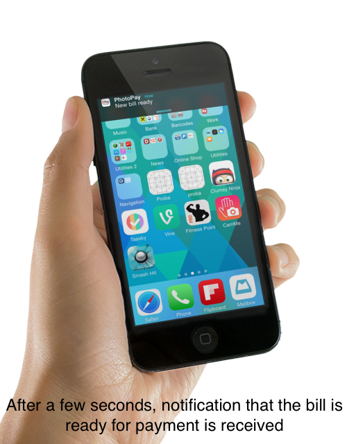
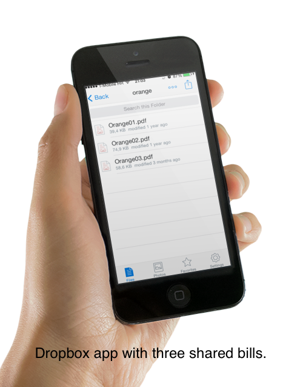
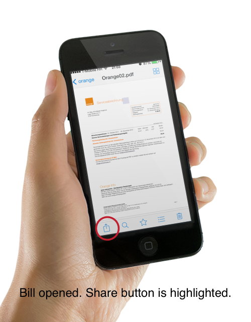
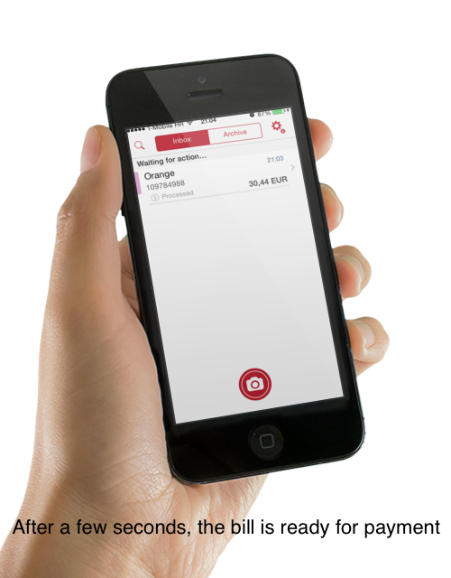

# How to use PhotoPay Cloud App

Here is a small guide on how to use PhotoPay Cloud app for simple bill payment. We offer three different use cases for paying paper or electronic bills, and those use cases are described here.

## 1. First run

On first run of the app, you will be asked to register your email address. This address will be used as your ID so we can identify your bills. It will also be used in the E-mail use case. Note: we'll not send spam to this address :) 

After you enter the address, you'll see our home view - a place where the bills and documents are stored.

## 2. Paying paper bills by taking photos

To pay a paper bill, launch the camera by tapping the big red camera button in the home view. Put the bill on a flat table, and position the camera so that the whole bill is seen in the photo. Keep the device flat above the bill, and wait for the camera to focus. When the photo looks sharp, take a photo, and confirm it. You can retake a photo if some parts of the bill aren't visible on the photo or if it's blurry.

Confirming the photo starts the upload to PhotoPay processing server. Depending on the internet connection, it might take a few seconds, as the size of the photo is typically 100-200 kB.

After the upload, document is queued for processing. Processing includes image enhancement, OCR, and payment data extraction. When the processing is done (typically in about 10-15 seconds), the document will automatically be refreshed in home view. You can view payment details by tapping the document in home view, and there you can make the payment. Note: the actual payment is currently not performed, as this is usually performed by a mobile banking app.

Payment data verification is required. Our processing server has a high data extraction accuracy, but 100% accuracy is technically impossible to achieve. That's why our app has an easy way to edit payment data, or to select one of values returned by the processing server (by pressing the arrow button besides a specific payment field).

If you have more than one paper bill to pay, you don't need to wait until the first bill is processed to send photos of other bills. Just take a photo of a bill, send it, take the next photo, send it, etc. Upload and processing is performed in background and in parallel.

## 3. Paying bills attached to e-mails.

Paying bills attached to e-mail has never been easier. Simply forward the bill with attached invoice to mybills@cloudbeta.photopay.net, and that's it. PhotoPay processing server will receive the email, identify the sender by the e-mail address, and when the payment data extraction is finished, notify the iOS app that the new bill is ready for payment.

That's why we required the email address on the first app run. The address is linked with the user account, and used to identify which user has sent the e-mail with bill attached. This means that PhotoPay can only process bills send by registered e-mail address

Also, PhotoPay processing server performs e-mail sender verification. We use SPF and DKIM systems to check if the sender is really who he says he is. This means no email spoofing and no payment fraud.

Currently PhotoPayCloud processing server supports only PDF and TXT documents. But support for other formats (.doc, .xls, .html, .xml, etc) will also be added, as they are also often used as bill document formats.

## 4. "Open In..."

There is one more way to pay a bill using PhotoPay Cloud. For example, if someone shares you a bill on Dropbox. You can open that bill in Dropbox app, press the "Share" button (as on the next image), choose "Open In..." option, and select "Open in PhotoPay". This will launch PhotoPay Cloud app, send that bill to PhotoPay processing server, and notify you when the payment data extraction is done. Typically, for PDF documents, this takes 2-3 seconds.

"Open In..." feature of iOS operating system is used by bunch of iOS apps. You can open a bill with PhotoPay Cloud from any of them - Dropbox was used just as an example. So if you use some other applications, e.g Safari browser, Google Drive, etc, bill payment is equally easy.

## 5. Archive of bills

All paid bills are archived in the Archive section of the Home view. This is a secure and reliable storage for all bills you have ever paid. Original bill, or a photo of a bill is also saved, so you never lose that valuable information again.

## 6. Wrap up

PhotoPay Cloud provides not just unmatched simplicity when paying bills, but also an archive of bills, which is an additional value by itself. 

Let us know what you think about the use cases on <info@photopay.net>.

