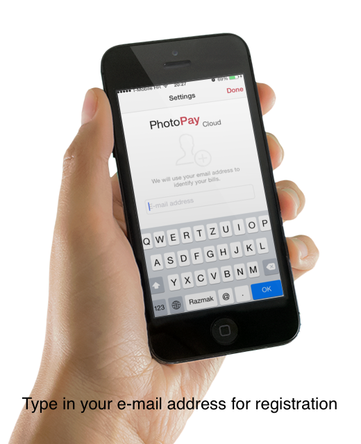
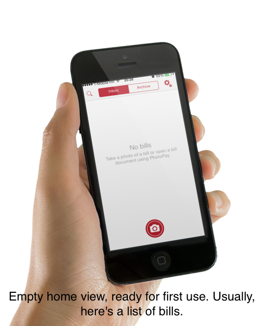
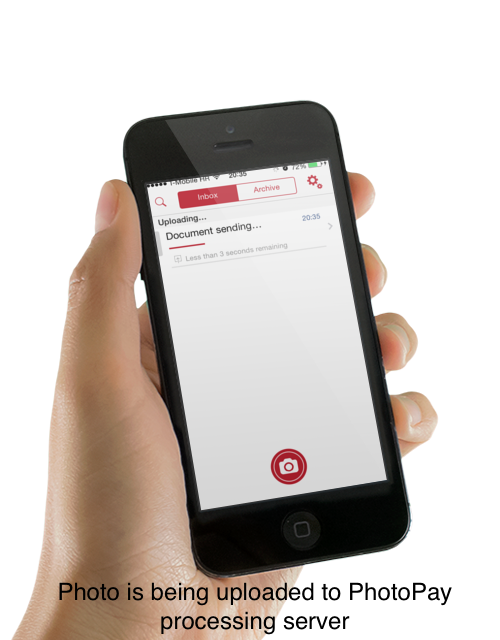
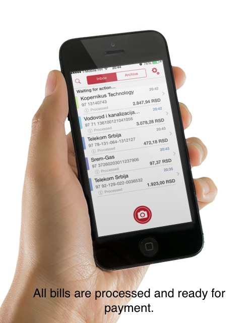
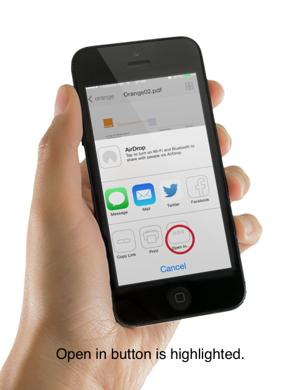
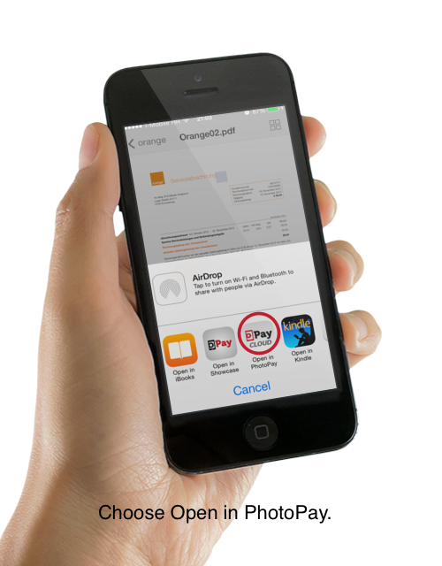
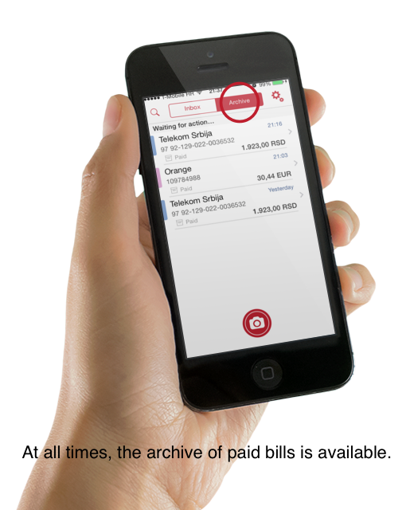

# How to use the PhotoPay Cloud App

Here's a short guide on how to use the **PhotoPay Cloud** app for simple and easy bill payment. We offer three different use-cases for paying paper or electronic bills, and we'll describe these use-cases here.

## 1. First run

When first starting the app, you'll be asked to register your email address. This address will be used as your ID so we can identify your bills. It will also be used in the E-mail use-case described below.

> Note: we will not send advertising to this address :) 

After you enter the address, you'll see our home view - a place where your bills and documents are stored.

## 2. Paying paper bills by taking photos

To pay a paper bill, launch the camera by tapping the big red camera button in the home view. Put the bill on a flat surface, and position the camera so that the whole bill is visible in the photo. Keep the device flat above the bill, and wait for the camera to focus. When the photo looks sharp, take a photo, and confirm it. You can retake a photo if some parts of the bill aren't visible on the photo or if turns out blurry.

Confirming the photo starts the upload to the **PhotoPay** processing server. Depending on your internet connection, it might take a few seconds, as the size of the photo is typically 100-200 kB.

After uploading completes the document is queued for processing. Processing includes image enhancement, optical character recognition, and payment data extraction. When processing is done (typically around 10-15 seconds), the document will automatically be refreshed in the home view. You can examine payment details by tapping the document in the home view, and there you can make the payment.

> Note: the actual payment is currently not performed, as this is usually performed by a mobile banking app.

Payment data verification is a required step. Our processing server has a high data extraction accuracy, but 100% accuracy is technically impossible to achieve. That's why our app has an easy way to edit payment data, or to select one of multiple values recognised by the processing server (by pressing the arrow button besides a specific payment field that had multiple possible values detected).

If you have more than one paper bill to pay, you don't need to wait until the first bill is processed to send photos of other bills. Just take a photo of a bill, send it, take the next photo, send that one, etc. Upload and processing is performed simultaneously in the background.

## 3. Paying bills attached to e-mails

Paying bills attached to e-mails has never been easier. Simply forward the bill with an attached invoice to mybills@cloudbeta.photopay.net, and that's it. The **PhotoPay** processing server will receive your email, identify you as the sender by the e-mail address that you entered previously, and when the payment data extraction is finished, notify the iOS app that the new bill is ready for payment.

That's why we required the email address on the first app run. The address is linked with the user account, and used to identify which user has sent the e-mail with an attached bill. This means that PhotoPay can only process bills send by registered e-mail addresses.

Also, the **PhotoPay** processing server performs e-mail sender verification. We use SPF and DKIM systems to check if the sender is really who he says he is. This means no email spoofing and no payment fraud.

Currently, the **PhotoPay Cloud** processing server supports only PDF and TXT documents. But support for other formats (.doc, .xls, .html, .xml, etc) will also be added in the future, as they are also often used as bill document formats.

## 4. "Open In..."

There is one more way to pay a bill using **PhotoPay Cloud**. For example, if someone shares a bill with you on Dropbox. You can open that bill in the Dropbox app, press the "Share" button (as on the next image), choose the "Open In..." option, and select "Open in PhotoPay". This will launch the **PhotoPay Cloud** app, send that bill to the **PhotoPay** processing server, and notify you when the payment data extraction is done. Typically, for PDF documents, this takes 2-3 seconds.

The "Open In..." feature of iOS is used by many iOS apps. You can open a bill with **PhotoPay Cloud** from any of them - we used Dropbox as just one example. So if you use some other applications, e.g the Safari web browser, Google Drive, etc, bill payment is just as easy.

## 5. Archive of bills

All paid bills are archived in the Archive section of the Home view. This is a secure and reliable storage for all bills you have ever paid. The original bill document, or a photo of a bill is also saved, so you can allways go back and review that information and never lose your payment history.

## 6. Wrap up

**PhotoPay Cloud** provides not just unmatched simplicity when paying bills, but also an complete archive of bills and bill payments, which is an great value by itself. 

Let us know what you think about these use-cases on <info@photopay.net>.

